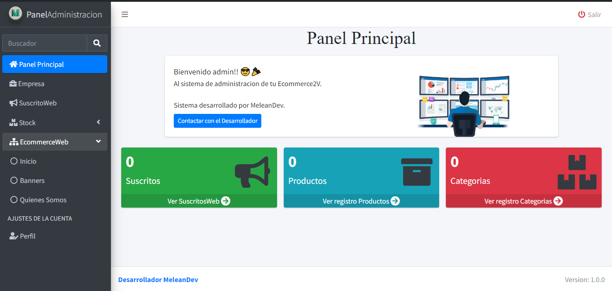

**No usar en temas empresarial, solamente para entorno de practica (desarrollo) si desea usar el codigo para tema empresarial o comercial cantacte al desarrollador Principal**
<p align="center"></p>
<p align="center"></p>
<p align="center"></p>
# WebSite con panel administrativo
## _Desarrollador MeleanDev 😎🧠_

Este proyecto esta hecho en laravel 11, espero que puedan practicar

# Características del sistema
### _Rutas Publicas y privadas_
- Publicas publicas:
Inicio
Productos -> Categorias
Categoria ->Producto
Quienes Somos?
Contacto
Login

- Rutas Privadas:
Panel Principal
Empresa
SuscritosWeb -> desean recibir correo cuando hay productos nuevos
Categorias - (Dentro de stock)
Productos - (Dentro de stock)
Inicio - (Dentro de EcommerceWeb)
Banners - (Dentro de EcommerceWeb)
Quienes Somos? - (Dentro de EcommerceWeb)
Perfil (Edicion del perfil del usuario admin)

## Tecnologias

Tecnologias y lenguajes usados en el proyecto:

- [Laravel 11] 
- [HTML5]
- [CSS3]
- [Javascript]
- [Nodejs]

## Instalacion

antes de empezar recordar tener ya instalado
- Composer 
- Nodejs
- PHP 8.2 Minimo

Para entornos de desarrollo, ejecutal dentro de la carpeta despues de haber clonado el repositorio...

```sh
composer install
npm install
```
## Licencia

GPL

**No usar en temas empresarial, solamente para entorno de practica (desarrollo) si desea usar el codigo para tema empresarial o comercial cantacte al desarrollador Principal**
